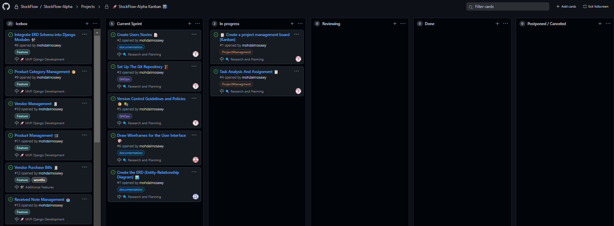

# StockFlow-Alpha
Inventory Management for Micro Home-Based Businesses (HBB)

## Project Overview
StockFlow is a one-week Proof-of-Concept project that aims to simplify inventory management and streamline the point of sale (POS) process for micro home-based businesses (HBBs). This system is designed to help HBB owners efficiently control their inventory and manage sales operations. In this initial phase of development, our primary focus will be on creating the Inventory Module and POS Module.

## Planning Stage

- **Project Management Board (Kanban):**
  
  - View our project's Kanban board for a visual representation of our project's progress and tasks.
  
- **Additional Planning Documents:**
  - **Wireframes:** Sketches of each screen's user interface for the major functionality of the application.
  - **Entity-Relationship-Diagram (ERD):** A diagram of the app's models (one per data entity) and the relationships between them.

### User Stories
- As a user, I want to log in to the system to access inventory management and POS features.
- As a user, I want to CRUD (Create, Read, Update, Delete) the products catalog in my system so that I can maintain an organized product listing.
- As a user, I want to CRUD (Create, Read, Update, Delete) the products in my system so that I can manage product details and stock levels efficiently.
- As a user, I want to CRUD (Create, Read, Update, Delete) the vendors in my system for better supplier management.
- As a user, I want to CRUD (Create, Read, Update, Delete) the Received Notes so that I can effectively control and update inventory based on incoming shipments.
- As a user, I want to CRUD (Create, Read, Update, Delete) the customers in my system to maintain a record of clients and their information.
- As a user, I want to CRUD (Create, Read, Update, Delete) the delivery notes to track and control outgoing shipments.
- As a user, I want to use the POS to register fast and quick sales invoices with visual product representation (pictures and colors) for a user-friendly experience.

### Admin Stories (To Be Added)

### WireFrames (Coming Soon)

### ERD

### Technologies Used

- **Frontend:** React.js + Django
- **Backend:** Django Python
- **Database:** Postgres
- **Other Tools:** [List any additional tools or libraries]


## Git Guidelines and Conventions

Effective version control is not just a best practice; it's a fundamental aspect of collaborative software development. At StockFlow, we prioritize a robust version control process as it plays a vital role in the success of our project.

By combining the best practices of DevOps with our Git guidelines and conventions, we create a powerful and efficient development workflow that fosters collaboration, reliability, and agility. These practices enable us to deliver high-quality software and maintain a robust, stable, and scalable application for our users.

### Working with Branches

1. **Pull from the main repo:** Before starting any work, ensure your local repository is up-to-date with the origin remote:
```
git pull origin main
```

2. **Create a New Branch for Your Design/Feature/Bug:** Create a new branch for the specific task you're working on. Name it descriptively and include the issue number in the branch name using #:
- For design: `git checkout -b "design/design-name#123"`
- For feature: `git checkout -b "feature/feature-name#123"`
- For bug: `git checkout -b "bug/bug-name#123"`

3. **Work on Your Task:** Make changes, write code, and complete your feature on the new branch.

4. **Commit Your Changes AND Commit Often:** Add and commit your changes to the local branch:
```
git add .
git commit -m "..."
```

5. **Pull the main AND resolve conflicts:** Before pushing your changes, make sure to pull from the origin to get the latest updates and resolve any conflicts with the main branch.

If you encounter conflicts, resolve them locally before creating a Pull Request. Ensure that your changes do not compromise any functionality as the main version is working correctly:
```
git pull origin main
```

### Pushing to Remote and Creating a Pull Request

1. **Push to Remote and Create a Pull Request:** Push your feature branch to the remote repository and create a pull request on the GA GitHub webpage:
```
git push "feature/feature-name#123"
```

Open the repository on the [StockFlow Pulls webpage](https://git.generalassemb.ly/StockFlow/StockFlow-Alpha/pulls). Click on the "Compare & pull request" button for the feature branch you just pushed.

2. **Review the changes in the pull request:** Mention the issue number in the pull request description to link it to the issue. Use "Closes #123" to indicate that the pull request will resolve the issue.

3. **Click on "Create pull request."**

### Switching Branches

On Your PC:

- After your pull request is approved and merged or if you need to switch to another branch, follow these steps:

1. **Get Latest Changes and Switch to Another Branch:** Merge the latest changes from the origin remote and switch to the main branch or another branch as needed:
```
git pull origin main
git checkout main # To switch to the main branch
git checkout "feature/another-feature-name#123" # To switch to another feature branch
```